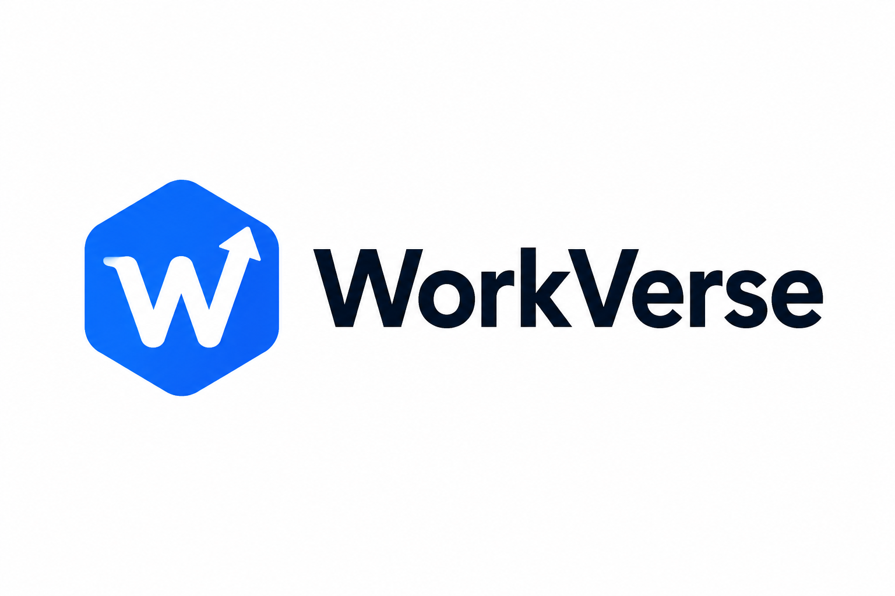

# 🎨 Brand Identity

# WorkVerse

Version: 1.0

Status: Brand Guidelines

Prepared By: WorkVerse Product Team

Last Updated: July 2026

---

# Purpose

This document defines the visual identity of WorkVerse.

Every screen, marketing asset, presentation, website, and future product must follow these branding guidelines to ensure a consistent experience.

The WorkVerse brand should represent innovation, professionalism, confidence, and growth.

---

# Brand Personality

WorkVerse is:

- Professional
- Innovative
- Friendly
- Modern
- Trustworthy
- Motivational

Users should feel like they are entering a real technology company rather than an educational website.

---

# Brand Voice

Tone

- Clear
- Helpful
- Encouraging
- Professional

Avoid:

- Complex jargon
- Overly casual language
- Marketing exaggeration

---

# Logo Philosophy

The logo should represent:

- Career Growth
- Technology
- Learning
- Progress
- Opportunity

Style

- Minimal
- Flat
- Modern
- Easily recognizable

---

# Color Palette

## Primary

Blue

HEX

#2563EB

Purpose

Primary buttons

Links

Highlights

---

## Secondary

Purple

HEX

#7C3AED

Purpose

Gradients

Illustrations

Accent Elements

---

## Background

White

HEX

#FFFFFF

---

## Surface

Light Gray

HEX

#F9FAFB

---

## Primary Text

Dark Gray

HEX

#111827

---

## Secondary Text

Gray

HEX

#6B7280

---

## Success

#16A34A

---

## Warning

#F59E0B

---

## Error

#DC2626

---

# Typography

Primary Font

Inter

Fallback

Source Sans Pro

Heading Weight

700

Body Weight

400

Button Weight

600

---

# Border Radius

Buttons

12px

Cards

16px

Dialogs

20px

---

# Shadows

Use soft shadows.

Avoid heavy shadows.

Cards should appear elevated but subtle.

---

# Buttons

Primary

Blue Background

White Text

Rounded Corners

Hover Effect

Slightly Darker Blue

---

Secondary

White Background

Blue Border

Blue Text

---

Ghost

Transparent

Dark Text

---

# Cards

Style

White Background

Rounded Corners

Soft Shadow

24px Padding

---

# Icons

Library

Lucide Icons

Style

Outline

Consistent Stroke Width

---

# Illustrations

Style

Minimal

Modern

Technology-themed

Use illustrations only to enhance understanding.

---

# Animations

Allowed

Fade

Slide

Scale

Hover

Progress

Counter

Avoid

Flashy animations

Long transitions

Distracting effects

---

# Spacing

Use an 8-point system.

Examples

8

16

24

32

40

48

64

80

---

# Accessibility

Minimum text contrast

WCAG AA

Keyboard Navigation

Required

Focus States

Required

---

# Final Vision

The WorkVerse brand should feel like a modern SaaS company focused on helping students confidently transition into the software industry.

Every visual element should reinforce professionalism, clarity, and growth.

---

> "WorkVerse isn't just a platform.

> It's where careers begin."

## Official Logo

Version

V1

Selected Concept

Concept 1 – Hexagon + W + Upward Arrow

## Logo Reference

> **Note:** This is the approved logo concept (Version 1). A final vector (SVG) version will be created before the public launch.

### Meaning

- Hexagon represents engineering, precision, and technology.
- The letter "W" represents WorkVerse.
- The upward arrow symbolizes career growth and continuous learning.

### Usage

- Website Header
- Dashboard
- Documentation
- GitHub Repository
- Mobile App
- Social Media
- Favicon